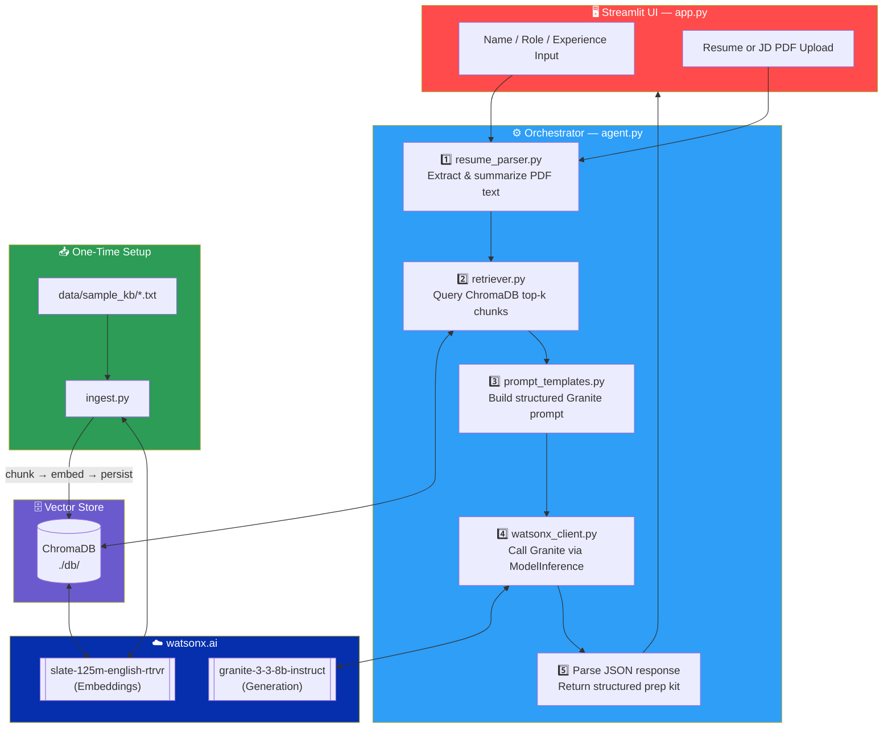
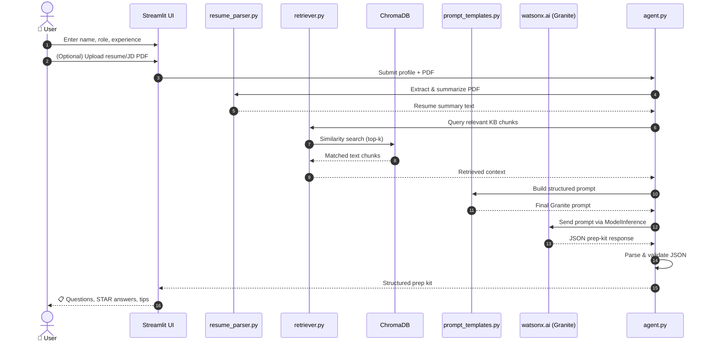

<div align="center">

# 🎯 Interview Trainer Agent

### AI-Powered Interview Preparation, Personalized by RAG + Granite


[](https://www.python.org/)
[](https://www.ibm.com/watsonx)
[](https://streamlit.io/)
[](https://www.trychroma.com/)
[](#-license)


</div>

---

## 📌 Table of Contents

- [Overview](#-overview)
- [System Architecture](#-system-architecture)
- [Data Flow](#-data-flow)
- [Project Structure](#-project-structure)
- [Prerequisites](#-prerequisites)
- [Setup & Run](#-setup--run)
- [Running Tests](#-running-tests)
- [License](#-license)

---

## 🧠 Overview

**Interview Trainer Agent** is a Retrieval-Augmented Generation (RAG) system built on **watsonx.ai** using the **Granite** foundation model family. Given a candidate's role, experience level, and (optionally) their resume or a target job description, it retrieves relevant context from a curated local knowledge base and generates a complete, structured interview prep kit — technical questions, behavioral STAR-format questions, model answers, and personalized improvement tips.

<div align="center">

| 🎓 Role-Aware | 📄 Resume-Aware | 🧩 RAG-Grounded | ⚡ Granite-Powered |
|:---:|:---:|:---:|:---:|
| Adapts to job role & seniority | Parses uploaded resume/JD PDFs | Retrieves from local ChromaDB | Uses `granite-3-3-8b-instruct` |

</div>

---

## 🏗 System Architecture



---

## 🔄 Data Flow




---

## 📂 Project Structure

```
Interview_Agent/
│
├── 📄 README.md
├── 📄 requirements.txt
├── 📄 .env.example
│
├── 📁 data/
│   └── 📁 sample_kb/
│       ├── 📝 software_engineer.txt
│       ├── 📝 data_analyst.txt
│       ├── 📝 hr_behavioral.txt
│       └── 📝 general_interview_tips.txt
│
├── 📁 src/
│   ├── 🐍 __init__.py
│   ├── 🔑 watsonx_client.py     # watsonx.ai credential setup
│   ├── 📥 ingest.py             # KB chunking, embedding, Chroma persistence
│   ├── 🔍 retriever.py          # Chroma query wrapper
│   ├── 📄 resume_parser.py      # PDF text extraction + LLM summarization
│   ├── ✍️ prompt_templates.py   # Structured Granite prompt w/ few-shot example
│   └── 🧠 agent.py              # End-to-end orchestration + JSON parsing
│
├── 🖥️ app.py                    # Streamlit frontend
│
└── 📁 tests/
    ├── 🐍 __init__.py
    └── ✅ test_ingest.py
```

---

## ✅ Prerequisites

- 🐍 Python 3.11+
- 📦 `pip` (or a virtual environment manager)
- 🔑 watsonx.ai API key, Project ID, and endpoint URL (add these to `.env`)

---

## 🚀 Setup & Run

### 1️⃣ Clone / unzip the project

```bash
cd Interview_Agent
```

### 2️⃣ Create a virtual environment

```bash
python -m venv .venv
# Windows
.venv\Scripts\activate
# macOS / Linux
source .venv/bin/activate
```

### 3️⃣ Install dependencies

```bash
pip install -r requirements.txt
```

### 4️⃣ Configure environment variables

```bash
cp .env.example .env
# Edit .env and fill in your watsonx.ai credentials
```

### 5️⃣ Build the vector store (one-time)

```bash
python src/ingest.py
```

This reads all `.txt` files in `data/sample_kb/`, chunks them, embeds them using the Slate embedding model, and persists the Chroma vector store to `./db`.

### 6️⃣ Run the Streamlit app

```bash
streamlit run app.py
```

Open your browser at **http://localhost:8501** 🎉

<div align="center">

</div>

---

## 🧪 Running Tests

```bash
python -m pytest tests/ -v
```

---


<div align="center">

---

Made with ❤️ using **watsonx.ai**, **Granite**, and **Streamlit**


</div>
