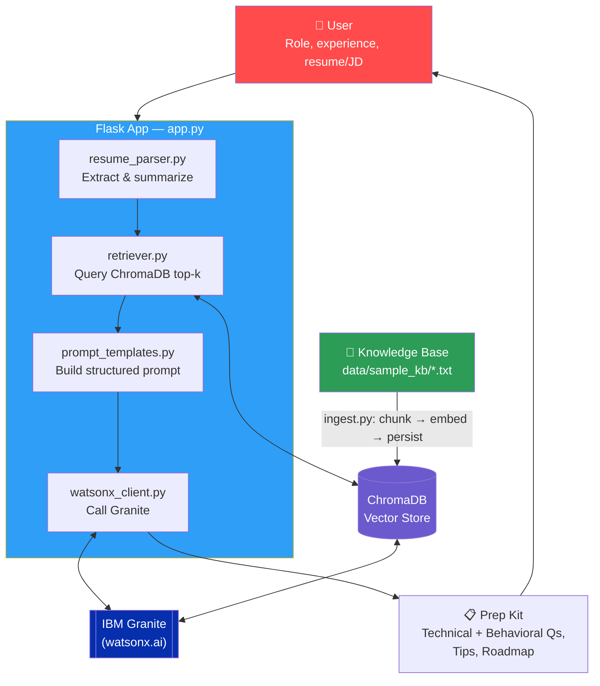

<div align="center">

# 🎯 Interview Trainer Agent

### AI-Powered Interview Preparation — RAG + IBM Granite + Flask

[](https://www.python.org/)
[](https://www.ibm.com/watsonx)
[](https://flask.palletsprojects.com/)
[](https://www.trychroma.com/)

### 🔗 [**Live Demo**](https://interview-agent-wirm.onrender.com/)

> Hosted on Render's free tier — the app may take ~30–60 seconds to wake up on first load if it's been idle.

</div>

---

## 🧠 Overview

**Interview Trainer Agent** is a Retrieval-Augmented Generation (RAG) system built on **IBM watsonx.ai** using the **Granite** foundation model. Given a candidate's role, experience level, and optionally their resume or job description, it retrieves relevant context from a curated knowledge base and generates a complete, structured interview prep kit.

| 💻 8 Technical Qs | 🤝 5 Behavioral Qs | 💡 3 Tips Each | 📅 Study Roadmap | 💬 Ask-Them Questions |
|:---:|:---:|:---:|:---:|:---:|
| Difficulty-tagged, with code examples & follow-ups | STAR outlines + competency tags | Specific & actionable | Week 1 → Week 2 → Day-before | 4 smart, role-specific questions |

---

## 🏗 System Architecture



---

## 📸 Screenshots

<table>
<tr>
<td width="50%">

**Landing Page**


</td>
<td width="50%">

**Target Role Selection**


</td>
</tr>
<tr>
<td width="50%">

**Technical Questions**


</td>
<td width="50%">

**Behavioral / HR — STAR Format**


</td>
</tr>
<tr>
<td width="50%">

**Prep Kit Overview**


</td>
<td width="50%">

**Confidence Checklist**


</td>
</tr>
</table>

---

## 📂 Project Structure

```
Interview_Agent/
├── app.py                  ← Flask application + routes
├── requirements.txt
├── Dockerfile               ← Used for Render deployment
├── .env.example
│
├── src/
│   ├── agent.py            ← Orchestration + JSON parsing
│   ├── prompt_templates.py ← Structured Granite prompt
│   ├── watsonx_client.py   ← IBM credentials + model clients
│   ├── retriever.py        ← ChromaDB similarity search
│   ├── resume_parser.py    ← PDF/TXT extraction + summarization
│   └── ingest.py           ← KB chunking, embedding, persistence
│
├── templates/               ← HTML (base + landing/results page)
├── static/                  ← CSS + JS (theme, form, accordion)
│
└── data/sample_kb/          ← Knowledge base (.txt per role/topic)
```

---

## ✅ Prerequisites

- Python 3.11+
- IBM Cloud account with watsonx.ai access
- Environment variables (copy `.env.example` → `.env`):

```env
IBM_API_Key=your_ibm_api_key
IBM_Watsonx_Project_ID=your_project_id
Watsonx_URL=https://us-south.ml.cloud.ibm.com
FLASK_SECRET_KEY=your-random-secret-key
```

---

## 🚀 Run Locally

```bash
python -m venv venv && venv\Scripts\activate   # (macOS/Linux: source venv/bin/activate)
pip install -r requirements.txt
cp .env.example .env        # then fill in your IBM credentials
python src/ingest.py        # one-time: build the vector store
python app.py                # open http://localhost:5000
```

---

## 🧪 Running Tests

```bash
python -m pytest tests/ -v
```

---

<div align="center">

Made with ❤️ using **watsonx.ai**, **IBM Granite**, **ChromaDB**, and **Flask**

</div>